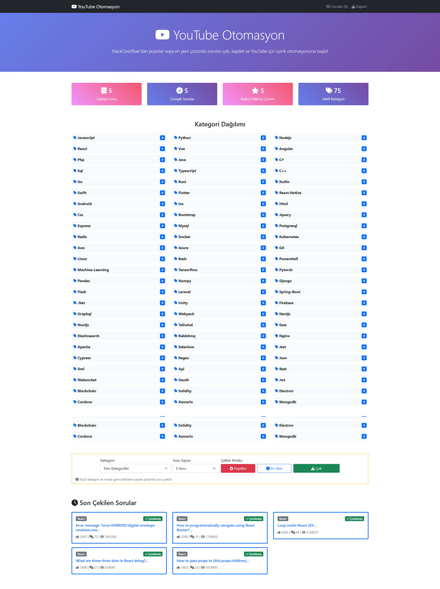
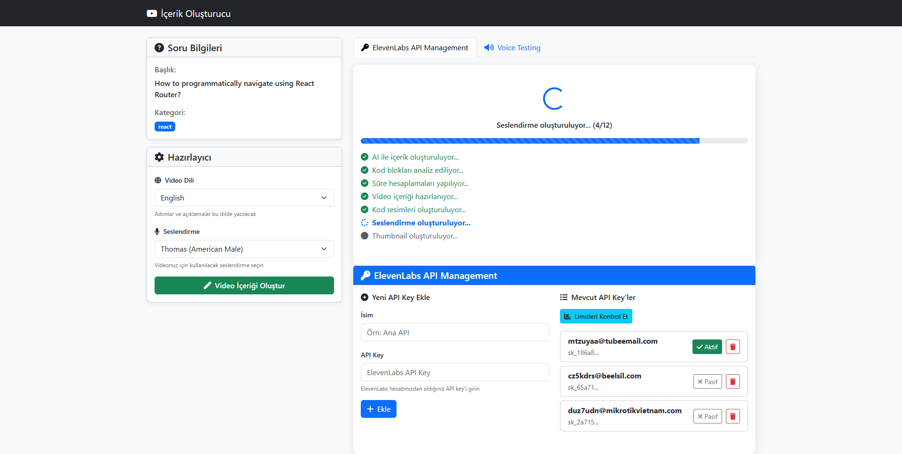

# StackOverflow RSS - Video Oluşturucu Bot

StackOverflow'dan belirli kategorilerdeki soruları RSS ile çeken ve JSON formatında saklayan,
Videoya dönüştürmeyi sağlayan bir Node.js web uygulaması.

| Bu repository ile oluşturulan YouTube kanal içerikleri: https://www.youtube.com/@codeclip_dev/videos




## Kurulum

1. Bağımlılıkları yükleyin:
```bash
npm install
```

2. Uygulamayı başlatın:
```bash
npm start
```
